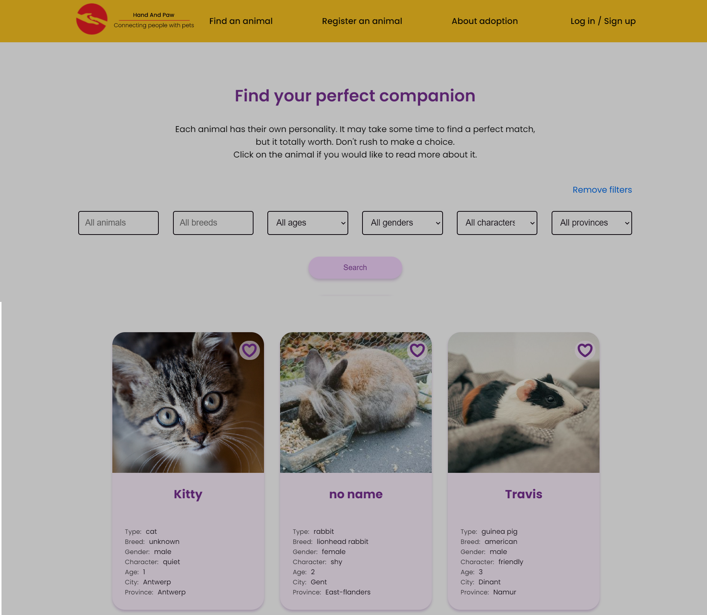

# Hand anD Paw

- [Hand an Paw](#hand-an-paw)

  - [About](#about)
  - [Screenshots Landing Page](#screenshots-landing-page)
  - [Screenshots App](#screenshots-app)
  - [Features](#features)
  - [License](#license)
  - [Tools and Technologies](#tools-and-technologies)
    - [UX/UI](#uxui)
    - [Front-End](#front-end)
    - [Back-End](#back-end)
    - [Dev-OPs](#dev-ops)
  - [Contribute](#contribute)
  - [Getting Started](#getting-started)
    - [Install database server](#install-database-server)
    - [In the Hand and Paw app repo](#in-the-hand-and-paw-app-repo)
    - [Using the API](#using-the-api)
    - [Run the app](#run-the-app)
  - [Contact](#contact)
  - [Project's landing page](https://handandpaw.herokuapp.com/landing-page/)

## About

"Hand and Paw" is a final project for HYF web-development course.
"Hand and Paw" is created to promote animal adoption in Belgium.

- it helps people to search for an animal they want
- people can find shelters by location
- people can find and add to favorites animals the consider for adoption
- it helps shelters to get more attention
- we aggregate all shelters in one app
- people can register new shelter
- shelters can create and account and add animals which will be found in a global pet search
- it helps newcomers with adoption process in Belgium
- the website provides information about adoption process in Belgium
- the website is in English

## Screenshots Landing Page

## Screenshots App

## Features

- Home Page Design
- Internal Web Pages
- Backend Admin
- Call to Action
- Favorites
- Mobile responsive
- Hamburger menu on mobile site
- Reviews and Testimonials

## License

MIT License

## Tools and Technologies

### UX/UI

Figma

### Front-End

- HTML
- CSS
- JavaScript

### Back-End

- Node.js 16.13.0
- Express 4.17.1
- Nodemon 2.0.2
- Mongoose 6.0.9
- Multer 1.4.3
- Sharp 0.29.2
- Nodemailer 6.7.0
- VSC 1.51
- Postman 8.3.0

### Dev-OPs

- Heroku

## Contribute

We are open for contributions, and we'll be glad to add new contributions to the project after acceptance criteria

## Getting Started

### Install database server

Follow the steps explained by [mongodb](https://docs.mongodb.com/manual/administration/install-community/)

### In the Hand and Paw app repo

- `npm install`
- **run the server**
  - `npm run dev:api` - uses `nodemon` to restart the server each time you save a change

### Using the API

- **from postman**
  - `{{url}}/api` - the main entry point to the API, must select in postman the environment, (**heroku** or **npm start**)
- **from the browser**
  - `http://localhost:xxxx/` serves `/api/<route-api>`

### Run the app

Only run the script `npm start`

## Contact

**Coach:** [Dirk Jacobs](https://github.com/dirk-jacobs)

**Project owner:** [Alina](https://github.com/alinamarasca)

**FrontEnd Developer:** [Alina](https://github.com/alinamarasca), [Zehra](https://github.com/zehrayelkenci), [Oksana](https://github.com/OksanaShulha)

**Backend Developer:** [Rafael](https://github.com/rago89), [Mayuri](https://github.com/mayuri2510)

**UX/UI designer:** [Oksana](https://github.com/OksanaShulha), [Zehra](https://github.com/zehrayelkenci)

**Dev-Ops:** [Alina](https://github.com/alinamarasca)
